# Rapport de Projet : Recréation d'Images Géométriques

## 1. Introduction

Ce rapport détaille la démarche adoptée pour résoudre le problème de recréation d'une image cible à l'aide de formes géométriques primitives (Rectangles, Cercles, Ellipses). L'objectif est de trouver la combinaison optimale de formes (positions, couleurs, dimensions) qui, une fois dessinées, ressemblent le plus possible à l'image originale. Ce problème d'optimisation a été abordé via différents algorithmes et heuristiques: Recherche Locale (Hill Climbing, Recuit Simulé) et Algorithmes Génétiques (GA Tournoi, GA Glouton). 

## 2. Modélisation du Problème

Durant tous mes tests il est m'est apparu comme une évidence que la qualité de la solution dépendait fortement de la modélisation choisie pour le génotype (représentation logique), le phénotype (rendu visuel) et la fonction objectif (évaluation/fitness). Plusieurs itérations ont permis de trouver des configurations offrant des résultats plus éfficaces mais surtout de mieux comprendre les limites de chaque approche.

### 2.1 Génotype
Le génotype est représenté par une classe `Genotype`. Cette classe est composé d'un entier w et h représentant la largeur et la hauteur de l'image, et d'une liste de formes (`SVGShape`) ainsi que d'une fitness (optionnelle).

L'ajout de w et h permet de contraindre les mutations et de s'assurer que les formes restent dans les limites de l'image. Ce fut une amélioration notable par rapport à la première version du code.

La fitness elle fut ajouté lors de l'implémentation des algorithmes génétiques en effet cela permettait de stocker la fitness de chaque génotype et d'éviter de recalculer la fitness de chaque génotype à chaque itération. Un gain notable en performance.

Pour ce qui est des formes, j'ai choisi de représenter les formes par des classes `SVGShape` qui sont des classes abstraites. 

*   **Formes supportées** :
    *   `Rect` (x, y, largeur, hauteur, couleur)
    *   `Circle` (cx, cy, rayon, couleur)
    *   `Ellipse` (cx, cy, rx, ry, couleur)
    *   `Triangle` (x1, y1, x2, y2, x3, y3, couleur)
*   **Couleur** : Représentée par un triplet (R, G, B, A) où A est la transparence (alpha). La transparence joue un rôle crucial pour permettre le mélange des formes.
Là aussi l'ajout de la transparence fut une amélioration notable par rapport à la première version du code. 

**Note:** Re-sizer les triangles fut difficile et j'ai du chercher en ligne et utiliser des llms pour trouver une solution.

**Note bis:** Les nouvelles formes ajoutées doivent respecter une taille minimale bien supérieur a 1 pixel (w/h >= 25 pour rect par exemple, radius >= 12px pour ellipse). Lors des differents resizing la taille minimale ne peut pas être inférieur a 5-3 pixel respectivement. C'est nécéssaire pour avoir un probleme qui ne converge pas vers des carré de la taille d'un pixel par exemple. Il est possible de mettre une autre taille par défaut avec le flag `--min-size`.


### 2.2 Phénotype
Le phénotype est l'image générée à partir du génotype.
*   **Génération** : Utilisation de la bibliothèque `PIL` (Python Imaging Library) et `ImageDraw`.
*   **Processus** : On crée une toile vide (noire ou blanche) et on dessine séquentiellement les formes de la liste, du fond vers le premier plan.
*   **Rendu** : Le résultat est une matrice de pixels (tableau numpy) comparable à l'image cible. L'utilisation de numpy a permis de comparer beaucoup plus rapidement les deux images qu'avec une liste standard de pixels.

### 2.3 Fonction Objectif (Fitness)
La fonction de fitness mesure la ressemblance (ou pluot dissemblance) entre le phénotype et l'image cible. Plus la valeur est basse, meilleure est la solution. L'approche qui m'est apparu la plus pertinente est celle qui pénalise le plus les grands écarts de couleur. Il me parraissait en effet qu'il était préférable d'avoir une image avec de légers défauts de couleur qu'une image avec de gros défauts de couleur.
*   **Approche initiale (L2)** : Somme des Différences au Carré (SSD).
    $$ \text{Fitness}_{L2} = \sum (P_{ij} - C_{ij})^2 $$
    Cette métrique pénalise fortement les grands écarts de couleur (ex: pixel blanc au lieu de noir).
*   **Approche alternative (L1)** : Somme des Différences Absolues (Manhattan).
    $$ \text{Fitness}_{L1} = \sum |P_{ij} - C_{ij}| $$
    Moins sensible aux valeurs aberrantes extrêmes que L2, elle a été testée pour voir si elle guidait mieux l'optimisation vers des détails fins.

Plusieurs autres approches aurait pu être envisagées et j'aurais voulu avoir le temps d'en tester plus notament:

* **La distance cosinus**: $$ \text{Fitness}_{cos} = \sum \frac{P_{ij} \cdot C_{ij}}{\|P_{ij}\| \|C_{ij}\|} $$
Cette mesure évalue l'angle entre les deux vecteurs images plutôt que la distance brute entre leurs valeurs. Sa particularité est d'être indépendante de la magnitude (l'intensité globale) donc certainement quelle aurait favorisé des solutions avec des couleurs similaire mais avec un ton différent.


---

## 3. Démarche et Expérimentations

Le développement s'est déroulé en plusieurs phases, explorées dans les notebooks `tp_svg.ipynb` et `tp_svg_2.ipynb` puis dans le notebook `comparison_notebook.ipynb`.

**Image de départ pour l'exploration:**


### 3.1 Approche Naïve et Validation (Squelette)
La première étape, réalisée dans `tp_svg_2.ipynb`, a consisté à mettre en place le squelette de l'application :
1.  **Structures de données** : Définition de la classe `Genotype` et des classes de formes (`SVGShape`, `Rect`, `Circle`).
2.  **Génération** : Implémentation de `generate_phenotype` pour transformer une liste de formes en image via `PIL`.
3.  **Fitness** : Implémentation de la fonction de fitness (L2 - Somme des différences au carré).
4.  **Premier Test** : Génération d'un génotype aléatoire simple (ex: un seul rectangle) pour valider que le pipeline "Génotype -> Phénotype -> Fitness" fonctionne correctement et produit un score cohérent.

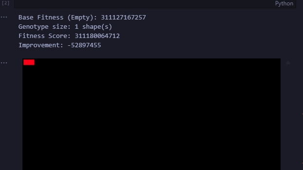

### 3.2 Optimisation Initiale : Le Redimensionnement (Resize)
Avant d'implémenter des algorithmes complexes, une première optimisation cruciale a été mise en place : le redimensionnement de l'image cible. 
Calculer la différence pixel par pixel sur une image Full HD est extrêmement coûteux. En réduisant l'image (par exemple à 256x256 pixels), on accélère drastiquement le calcul de la fitness (qui est appelé des milliers de fois), tout en conservant suffisamment de détails pour que les formes géométriques puissent s'adapter. C'est un compromis indispensable entre vitesse et résolution.

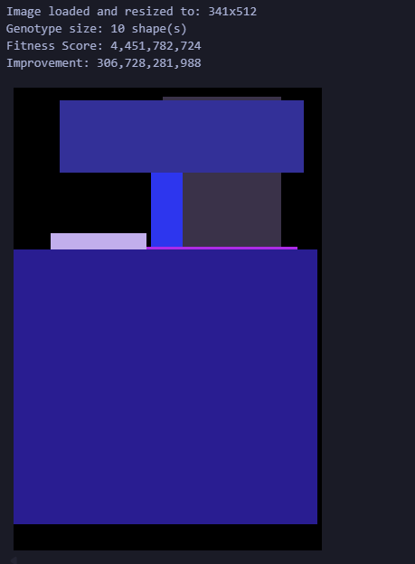


### 3.3 Recherche Locale : Hill Climbing
Une fois le pipeline validé, l'algorithme d'optimisation le plus simple a été implémenté : le **Hill Climbing** (Montée de colline).
*   **Principe** : On part d'une solution actuelle (initialement aléatoire ou vide). A chaque itération, on crée une copie mutée de cette solution (ajout/suppression/modification d'une forme). Si la nouvelle solution a une meilleure fitness (score plus bas), elle remplace la solution courante. Sinon, elle est rejetée.
*   **Implémentation** :
    *   *Mutation* : Choix aléatoire de modifier la position, la taille, la couleur ou le type d'une forme ainsi que d'en ajouter une. Au moment de tester les mutations je n'avait que celles-ci d'implémenter. J'ai ensuite ajouté la possibilité de supprimer une forme. Cela me semblait judicieux car il me parraissait probable qu'une solution avec moins de forme puisse être plus optimale à partir d'un certain point. Ex: 4 carrés de couleur moyenne peuvent être remplacés par 1 carré de couleur parfaite. 
    *   *Boucle* : Itération tant que le score s'améliore ou jusqu'à un nombre max d'itérations.
*   **Résultats & Limites** : Cette méthode converge très rapidement au début. Cependant, elle a tendance à rester bloquée dans des **optimums locaux** : une fois qu'une forme est "à peu près" bien placée, il est difficile pour l'algorithme de la déplacer radicalement ou de la supprimer pour faire mieux, car toute modification intermédiaire dégrade temporairement le score. C'est là que l'ajout de perturbations comme vu en cours aurait pu être une solution. Dans mon implémentation j'ai ajouté un nombre max d'itération sans amélioration du score avant d'arrêter l'algorithme. 
Une expérience que j'aurais voulu tester est l'ajout d'une perturbation sufisament importante apres ce nombre d'itération pour permettre de sortir de ce minimum local plutot que l'arret de l'algorithme. Il aurait été intéressant de voire si l'algorithme convergeait plus vite avec une "patience" (nom de la variable) très grande mais pas de perturbation ou avec perturbation mais une patience très faible.

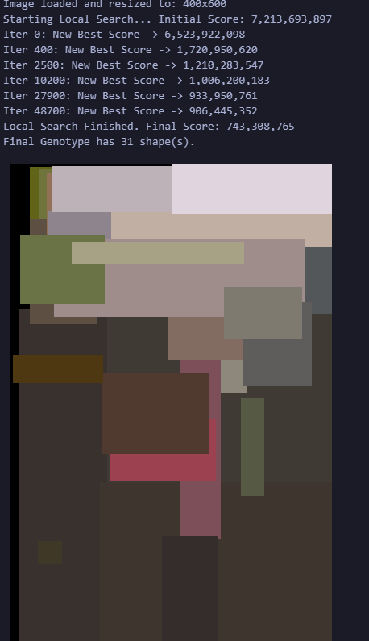

On remarque enfin que l'image finale ressemble de loin à l'image de départ mais avec des formes beaucoup plus grosses et peu de détails. 

### 3.4 L'Apport de l'Heuristique : Grid Initialization
L'une des découvertes majeures de l'exploration a été l'importance de l'initialisation. Partir d'une toile blanche ou de formes totalement aléatoires oblige l'algorithme à passer des milliers d'itérations à simplement "couvrir" l'image. 
*   **Solution (Grid Seeding)** : Initialiser le génotype en plaçant des formes sur une grille régulière (ex: 10x10), où chaque forme prend la couleur moyenne de la zone de l'image qu'elle recouvre.
*   **Impact** :
    *   Le score de départ est drastiquement meilleur (image déjà reconnaissable, effet "mosaïque").
    *   Les algorithmes (Hill Climbing ou GA que nous verront par la suite) peuvent immédiatement se consacrer à l'optimisation fine (ajustement des bords, tailles, fusion de formes) plutôt qu'au remplissage grossier.
    *   C'est cette technique qui a permis d'obtenir les résultats les plus visuellement impressionnants en un temps raisonnable.
*   **Obstacles** : Avant d'avoir les résultats vraiment concluent j'ai d'abords eu du mal à améliorer l'image de départ. En effet à chaque fois que je tentais d'appliquer des mutations sur l'image de départ, j'obtenais une image de moins bonne qualité. Mon algorithme s'arretait car le nombre d'itération sans amélioration du score (ma "patience") était atteint.
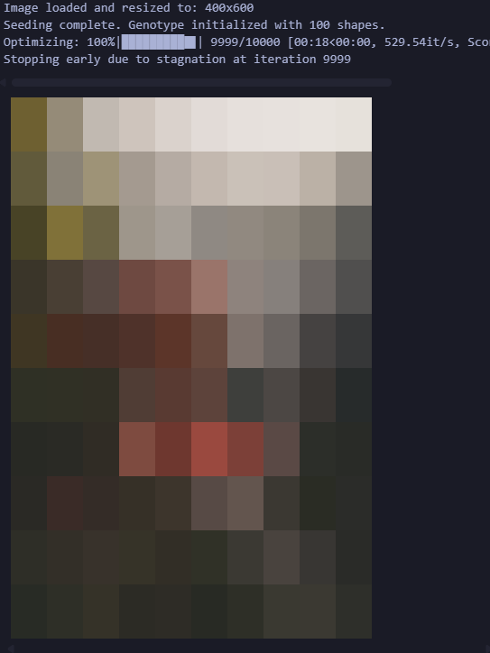

### 3.5 Nouvelles Heuristiques: Ajout de formes et Resize des formes
Pour améliorer mon algorithme j'ai mis en place deux nouvelles heuristiques
*   **Ajout de formes** : Les nouvelles formes ajoutés commencent elle aussi avec la couleur moyenne de la zone de l'image qu'elle recouvre.
*   **Resize des formes** : Les formes existantes sont redimensionnées avec un pas toujours aléatoire mais controllé (+/-10%). 
On voit ici le resultat avec seulement 2k itérations vs 10k plus haut.
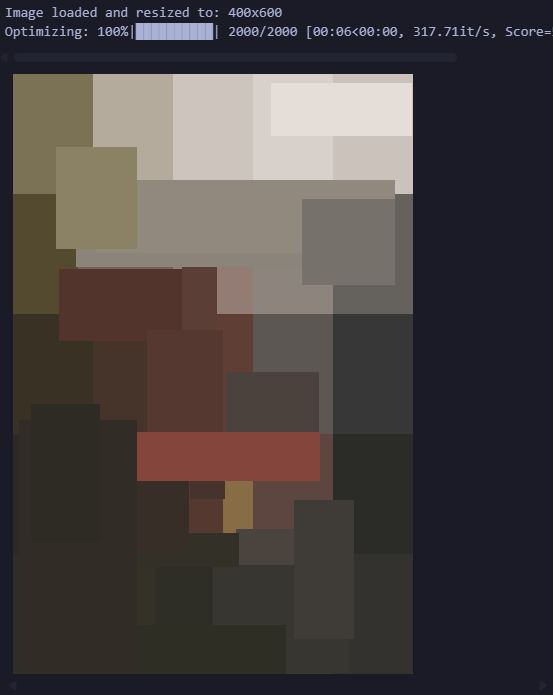


### 3.6 Ajout de la loss

Afin de mieux comprendre comment fonctionnait mon algorithme j'ai ajouté la loss par itération afin de pouvoir visualiser celle-ci.
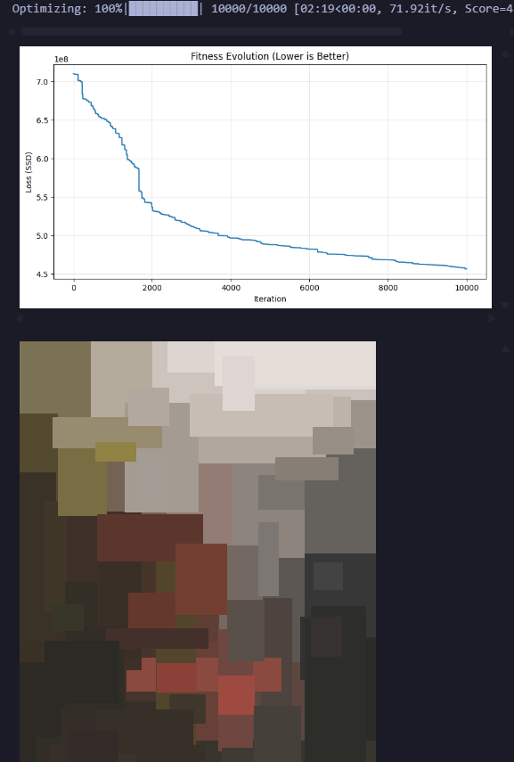
On voit ainsi qu'avec la recherche locale mon algorithme converge vite au début avec des drops parfois très importants au début (une mutation aléatoire peut grandement améliorer mon score). Cependant, il a tendance à rester bloquée dans des optimums locaux par la suite.

Pour tester:
```sh
python3 main.py --algorithm hill_climbing --max-iter 10000 --shape rect --fitness l2 --image popart.png --show-loss
```

### 3.7 Exploration Avancée : Simulated Annealing
Pour tenter de résoudre le problème des optimums locaux rencontré avec le Hill Climbing, le **Simulated Annealing** a été testé dans le notebook `tp_svg_2.ipynb`.
*   **Principe** : L'algorithme fonctionne comme le Hill Climbing, mais avec une différence majeure : il accepte parfois des solutions *moins bonnes* avec une certaine probabilité `P`.
*   **Température** : Cette probabilité dépend d'une "température" `T` qui diminue au cours du temps (refroidissement).
    *   Au début (`T` élevé) : L'algorithme accepte beaucoup de dégradations, ce qui lui permet d'explorer l'espace de recherche et de "sortir" des mauvaises configurations.
    *   À la fin (`T` proche de 0) : Il se comporte comme un Hill Climbing classique pour affiner la solution.
*   **Observation** : Ici on voit que le Simulated Annealing permet de sortir des optimums locaux mais et que le score converge de facon beaucoup plus "smooth" qu'avec le Hill Climbing et d'ailleurs beaucoup plus vite au début. Parcontre une fois que le score converge, il converge de facon beaucoup plus lent avec des paliers parfois très long (ex: entre itérations 4500 et 6500).  

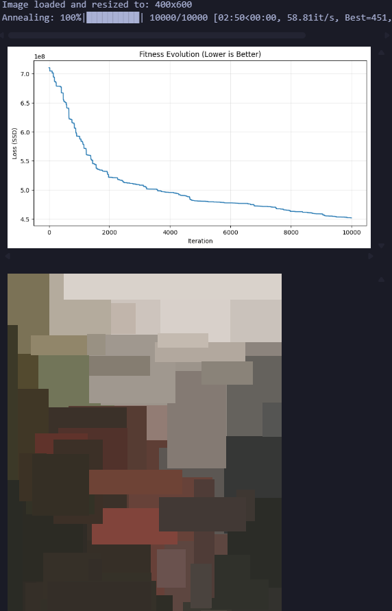

Pour tester:
```sh
python3 main.py --algorithm simulated_annealing --max-iter 10000 --shape rect --fitness l2 --image popart.png --show-loss
```


### 3.8 Algorithmes Génétique
Pour explorer l'espace de manière plus parallèle et robuste, une approche évolutive a été implémentée.
*   **Population** : Au lieu d'une seule solution, on maintient une population de `N` individus (génotypes).
*   **Sélection** : Les meilleurs individus sont sélectionnés pour se reproduire. Dans un premier temps j'ai testé la selection **Greedy** qui consiste à garder les meilleurs individus. Ensuite pour maintenir une bonne diversité j'ai testé la selection **Tournoi** (prendre k individus au hasard et garder le meilleur).
*   **Croisement (Crossover)** : Deux parents mélangent leurs gènes (listes de formes) pour créer un enfant. Cela permet de combiner les "bonnes zones" de l'image trouvées par l'un avec celles trouvées par l'autre.
*   **Mutation** : Appliquée aux enfants pour introduire de la nouveauté.
*   **Avantage** : Permet de trouver des solutions plus globales et de ne pas dépendre d'un seul point de départ.
*   **Observations** : C'est ici que l'implémentation de la fitness comme attribut de la classe `Genotype` est devenu quasi obligatoire pour éviter de devoir recalculer la fitness à chaque itération. Le nombre d'itérations est évidement plus faible ici que pour les algorithme de recherche locale car il y'a aussi la gestion de la population. On peut observer que pour les deux algorithmes la fitness chute de manière excessivement abrupte au début. Mon hypothèse est que l'ensemble de population de depart permet une convergence rapide car le choix des meilleurs individus permet de garder les meilleurs solutions.

Le Tournois dans mon premier test converge legemerement plus vite au début mais ensuite la fitness chute de manière beaucoup plus lente et avec des paliers beaucoup plus longs que le Greedy.

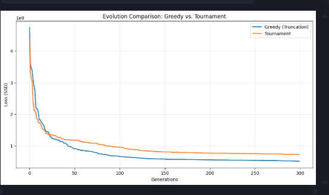

```sh
# Greedy
python3 main.py --algorithm ga_greedy --max-iter 300 --shape rect --fitness l2 --image popart.png --show-loss

# Tournament
python3 main.py --algorithm ga_tournament --max-iter 300 --shape rect --fitness l2 --image popart.png --show-loss
```


---

## 4. Comparaisons et Résultats

Les tests comparatifs finaux ont été menés dans `comparison_notebook.ipynb`, avec un budget temps fixe (5 minutes par algorithme) pour une comparaison équitable entre genetic et local search. 

*Note: Les dépendances sont légerement différentes pour faire tourner ce notebook, il faut avoir installé `pandas`.* 

Pour ces tests j'ai changé l'image par `popart.png` pour visuellement avoir une meilleure appreciation des résultats.

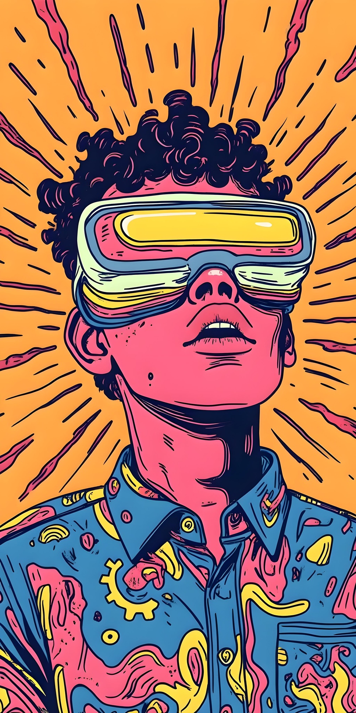

### 4.1 Comparaison des Algorithmes
*   **Hill Climbing** : Très efficace en temps court grâce à la rapidité des itérations (une seule évaluation/mutation).
*   **GA** : Converge plus lentement en temps horloge car la gestion de la population est coûteuse, même si le nombre d'itérations "logiques" pour atteindre un bon résultat peut être intéressant.
*   **Conclusion** : Pour cette comparaison spécifique on voit à la fois au niveau de la fitness que de l'image que le hill climbing est plus efficace que les autres. Ce qui est néanmoins intéressant est que le GA greedy obtient une image assez similaire à l'originale (grossièrement) mais avec beaucoup moins de formes que le hill climbing. C'est le cas pour le GA tournament aussi même si moins proche. Pour autant la fitness est plus haute pour le greedy que pour le simulated annealing alors que l'image parait presque plus proche de l'originale. *C'est la limite de la fitness choisie, elle donne une direction mais son score ne reflete pas toujours le meilleur résultat.*

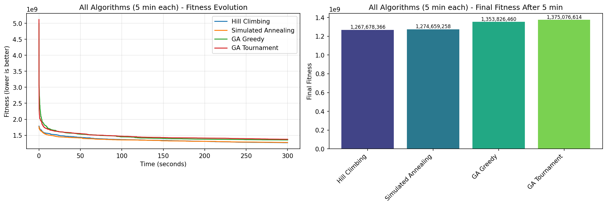
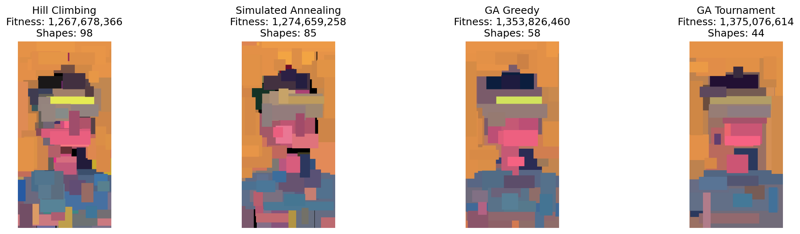

### 4.2 Impact de l'Heuristique
La comparaison suivante vient de l'ajout d'une heuristique initiale pour les algorithmes GA. Pour booster le résultat les genotypes initaux j'ai ajouté le même concept de grille que pour le hill climbing. Pour ne pas avoir 50 fois les memes "grilles" de depart j'ai appliqué un leger bruit sur chacune des grilles pour que les genotypes soient tous différents. 

L'initialisation par grille (Grid Initialization) apporte un gain de fitness initial massif.
*   **Sans heuristique** : Les algos passent beaucoup de temps à juste "remplir le vide".
*   **Avec heuristique** : L'image est déjà beaucoup plus proche de l'originale à t=0. Les algos passent leur temps à affiner les détails. C'est l'amélioration la plus significative.

```sh
# Avec Heuristique
python3 main.py --algorithm ga_tournament --max-iter 300 --shape rect --fitness l2 --image popart.png --show-loss --heuristic

# Sans Heuristique
python3 main.py --algorithm ga_tournament --max-iter 300 --shape rect --fitness l2 --image popart.png --show-loss 
```

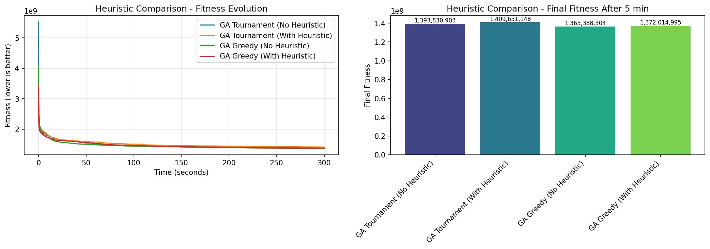
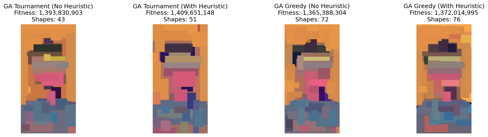

### 4.3 Formes (Rectangle vs Cercle vs Ellipse)
*   **Rectangles** : Meilleurs pour des images structurée. 
*   **Cercles/Ellipses** : Plus esthétiques pour des images organiques (visages, paysages naturels), créant un effet "pointilliste" ou "cellulaire".
*   **Triangles** : Très polyvalents, ils permettent de créer des formes complexes par approximation polygonale, mais l'optimisation par mutation peut être semble beaucoup plus chaotique visuellement.

```sh
# Rectangles
python3 main.py --algorithm hill_climbing --max-iter 5000 --shape rect --fitness l2 --image popart.png --show-loss

# Cercles
python3 main.py --algorithm hill_climbing --max-iter 5000 --shape circle --fitness l2 --image popart.png --show-loss

# Ellipses
python3 main.py --algorithm hill_climbing --max-iter 5000 --shape ellipse --fitness l2 --image popart.png --show-loss

# Triangles
python3 main.py --algorithm hill_climbing --max-iter 5000 --shape triangle --fitness l2 --image popart.png --show-loss

```

Si on note ces quelques différences, les algorithmes sont tout a fait les mêmes. Il aurait été intéressant d'ajouter des formes nouvelles comme les polygones, permettant de créer des formes plus complexes et de nouvelles possibilités d'images. Mon hypothèse est que l'on peut obtenir avec beaucoup moins de formes une image très proche de l'originale pour autant le nombre de solutions voisines devient beaucoup plus élevé car la diversité des mutations augmente.

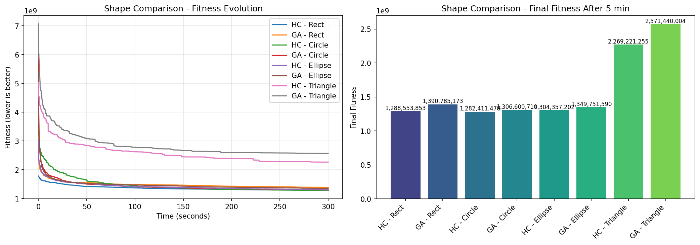
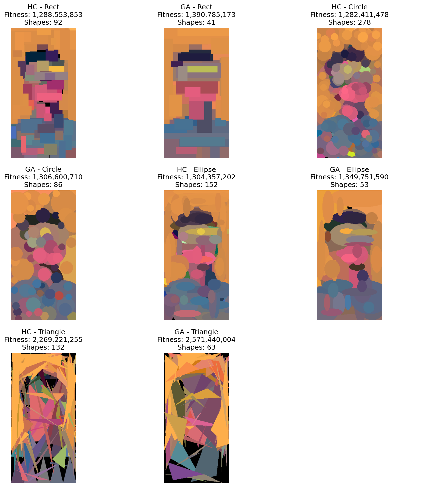

### 4.4 Fitness L1 vs L2
*   **L2** privilégie la réduction des grosses erreurs (bruit fort).
*   **L1** Beaucoup moins de formes utilisées. Le resultat donne moins de détails. Difficile de comparer en termes de fitness car l'échelle est completement differente. Il aurait fallut utilisé la RMSE mais calcul beaucoup plus lent. 

```sh
# Fitness L2
python3 main.py --algorithm hill_climbing --max-iter 5000 --shape rect --fitness l2 --image popart.png --show-loss

# Fitness L1
python3 main.py --algorithm hill_climbing --max-iter 5000 --shape rect --fitness l1 --image popart.png --show-loss
``` 

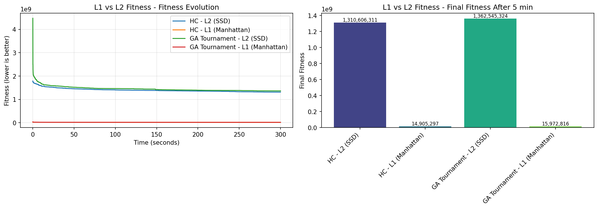
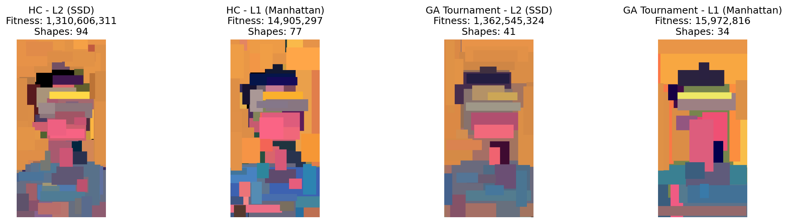

## 5. Conclusion

La modélisation vectorielle d'images est un problème d'optimisation passionnant. Mon exploration, étonnament, semble montrer que la représentation simple (liste de formes) couplée à une évaluation coûteuse (rendu image) favorise les algorithmes locaux rapides (Hill Climbing). L'apport le plus significatif ne vient pas de l'algorithme lui-même, mais de l'injection de connaissance du problème via l'initialisation heuristique.

Le nombre de test à réaliser semble presque infinis. J'aurais voulu tester plus d'algorithmes et surtout tester d'autres heuristiques pour initialiser les genotypes. 
L'une des stratégies que j'aurais voulu mettre en place est pour chaque mutation prendre un echantillon de n pixels, et appliquer une mutation sur celui ayant l'écart le plus élevé avec l'image originale. Pour moi cela aurait rallongé le temps de calcul mais aurait permis de converger vers des solutions plus proches de l'originale.
Encore une fois je suis un peu déçu de ne pas avoir pu implementer les perturbations pour sortir des minima locaux. 
Pour ce qui est des mutations les rotations auraient pu être facilement implémentées et surement permis de converger un peu plus vite.

Des images illustratives des performances (courbes de convergence) et des résultats visuels sont disponibles dans le dossier `docs/` généré par le notebook de comparaison.

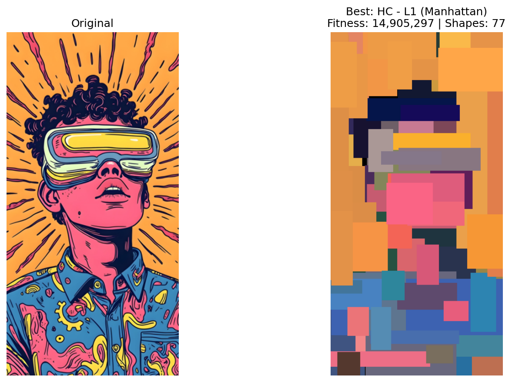
